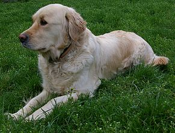

<!DOCTYPE html>
<html>
<head>
	<meta charset="utf-8">
	Animal Trading Cards
	<link rel="stylesheet" href="styles.css">
</head>
<body>
	

		<h3>Golden Retriever</h3>
		
		

		  
It's a breed of hunting dogs.

			 <ul>
        <li>Particular aspects: These dogs must run daily</li>
				<li>Average Lifespan: They arrive on average at the age of 12 although they happen to live up to the age of 16-17 years</li>
				<li>Training: Golden Retriever is a smart and very easy to train dog</li>
				<li>Relationships with family and house: Golden Retriever is an excellent pet dog</li>
			 </ul>
			
Golden Retriever is a breed of popular hunting dogs in Scotland. Golden Retrievers have consistently hit the top of the list of the most beloved companion dogs to the family. 

		

	

</body>
</html>
